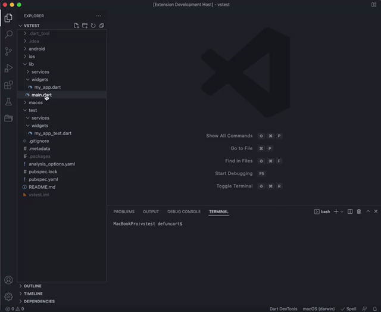
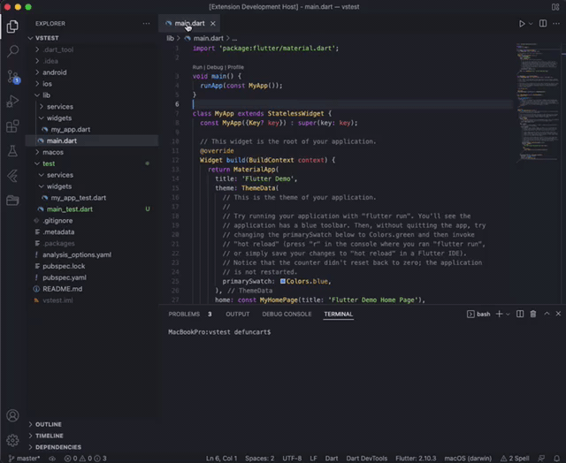

# Dart File Utils

A Visual Studio Code extension with useful utils for dart files.

**NOTE** Although `dart.goToTestOrImplementationFile` from [Dart Code](https://marketplace.visualstudio.com/items?itemName=Dart-Code.dart-code) allows the opening/creation of dart tests, it does not support context menus.

## How to Use

### Command Palette

* Bring up the command palette, and select `Dart File Utils: `.
* Select one of the commands mentioned below.
* Press [Enter] to confirm, or [Escape] to cancel.

### Explorer/Editor Title Context Menu

Right click on a dart file and select of the commands mentioned below.

## Features

### createTest

Creates an empty test file for a selected dart file in `lib`.

### openTest

Opens a test file for a selected dart file in `lib`.

## Conventions

- Given files `lib/screens/home_screen.dart` and `lib/src/models/user.dart`, this extension determines the corresponding test paths as `test/screens/home_screen.dart` and `test/models/user.dart` respectively.
- Part files such as `user.g.dart`, `user.freezed.dart` and `cubit.part.dart` are automatically convert to their main file `user.dart` etc.

## Disclaimer

* This extension will create files on your hard drive, and if necessary, recursively create folders. Although no files should be overridden, no data loss guarantees are given.
* This extension has been developed and tested on macOS. Linux and Windows may work, but this is not guaranteed.

## Special Thanks

* [File Utils](https://github.com/sleistner/vscode-fileutils) which served as an initial inspiration.

## Collaboration

Spotted any issues? Please open [an issue on GitHub](https://github.com/defuncart/vscode-dartfileutils/issues)! Would like to contribute a new util? Fork the repo and submit a PR!
